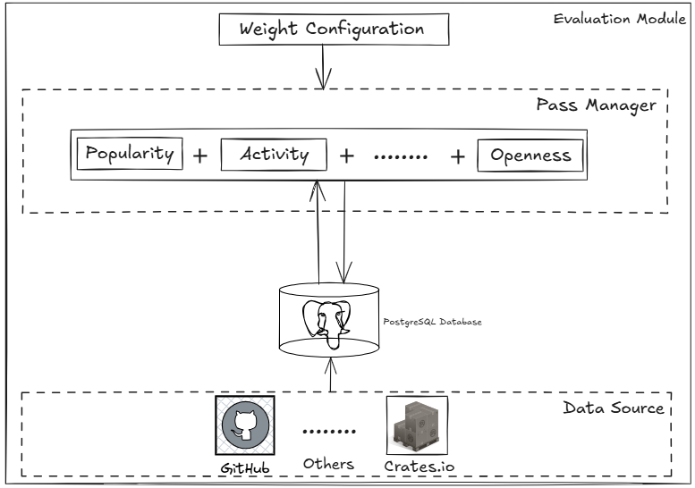

# 模块化评价系统设计文档

## 1. 系统概述

**模块化评价系统**（`Modular Evaluation System, MES`）旨在通过`Github`、`Crates.io`提供的数据（不包含代码层面的分析）对`crate`从其他层面进行综合评价，
诸如参与者数量、星标数、`fork`数、开放问题数等（具体[指标](#3-评价元数据)见第四节），最终生成每个库的综合评价分数或报告。为开发者从一个新角度提供参考。
MES采用模块化、可插拔的设计，评价算法独立、复用且配置可通过全局统一管理，能够灵活适应不同的评价标准和数据处理需求。

目标

- 模块化：每个评价算法封装为独立的`pass`，支持独立开发和测试。
- 可插拔性：`pass`可以动态添加、移除或重新排序，无需修改核心系统。
- 可扩展性：支持轻松集成新的评价算法或数据源。
- 可伸缩性：高效处理`PostgreSQL`中的大数据集，减少性能瓶颈。
- 灵活性：通过配置（例如权重、阈值）支持自定义评价设计。
- ......

范围

- 数据库：PostgreSQL
- 数据源：Github、Crates.io等（后面或许会再添加）
- 评价方法：受欢迎程度、社区活跃度、维护情况、技术成熟度、开放性、成长潜力、安全与合规性、文件结构完整度等
- 语言技术：Rust、Sql、GraphQL API
- 限制：不涉及代码层面的分析；仅基于公开数据，不支持私有仓库的评价
- ......

## 2. 系统架构

MES架构受编译器优化pass模型启发，每个pass转换中间表示（IR）。在这里，IR是一个包含库元数据和评价结果的结构化上下文。

### 2.1 系统示意图



### 2.2 模块结构划分

**评价算法逻辑部分**具体实现在

```text
├── src/ 
│   ├── config.rs                      # 处理配置文件解析的Context结构体
│   ├── main.rs                        
│   ├── manager.rs                     # 管理各 pass 的注册和执行顺序
│   └── pass/                          # 定义各评价方法及其实现(待补充)
│      ├── mod.rs                      # 声明 trait,易于后续扩展新的评价方法
│      └── popularity.rs               # 受欢迎程度评价方法
├── Cargo.toml
├── config.toml                        # 配置文件，全局管理各评价方法的权重
└── README.md        
```

**数据采集部分**具体实现在`github-handler`模块中（`src/services/github_api.rs`）

**数据库交互部分**具体实现在`database`模块中（`src/storage/evaluate_database.rs`）

### 2.3 核心组件

- **评价模块Pass(Any Evaluation Pass):**

  使用trait: AnyEvaluationPass，定义所有评价算法的通用接口。

  各评价算法实现该trait，通过接收对应的配置信息EvaluationContext和数据库连接（评价的数据）作为输入，进行逻辑处理并更新（例如计算部分分数或规范化数据）。

- **Pass管理器（Pass Manager）：**

  一个调度器（EvaluationManager），负责协调各评价算法的的执行。

- **数据库交互（evaluate_database） ：**

  数据获取：通过数据库通道从PostgreSQL数据库中获取数据。

  数据存储：最终的得分或者评价存储回PostgreSQL数据库。

- **权重等配置（EvaluationContext）：**

  配置系统(例如TOML文件)，用于定义：
  各评价算法权重
  各评价算法中特定的参数(例如权重、阈值),
  数据库连接设置。

## 3. 评价元数据

以下是一份 **GitHub 仓库元数据字段清单**，按类别分类。

- [受欢迎程度高](#受欢迎程度高)：仓库被广泛关注和使用，反映社区对项目的认可。
- [社区活跃](#社区活跃)：社区是否积极参与，是否有人响应、参与和推动问题处理与代码演进。
- [维护良好](#维护良好)：仓库是否仍在被维护、是否具有健康的开发节奏。
- [技术成熟](#技术成熟)：是否使用主流语言、有正式版本、代码结构合理、质量稳定。
- [开放性强](#开放性强)：是否欢迎他人参与、使用和复刻，文档是否清晰，访问是否受限。
- [成长潜力](#成长潜力)：是否处于快速成长中，是否有未来价值
- [安全与合规性](#安全与合规性)：项目是否考虑安全问题，是否合规
- [文件结构完整度](#文件结构完整度)：项目是否具备合理的元信息和文档结构
- (待补充)

### 🏅受欢迎程度高

| 数据                        | 类型   | 说明                | 获取方式                  |      实现      |
|:--------------------|--------|---------------------|-----------------------|:------------:|
| `stargazerCount`          | 直接   | star 数             | GraphQL        |      t       |
| `forkCount`               | 直接   | fork 数             | GraphQL         |      t       |
| `watchers.totalCount`     | 直接   | 订阅者数            | GraphQL               |      t       |
| `used_by` 项目数量            | 间接   | 有多少项目依赖它（常见于库类项目） | crates.io | 本地没有数据，未加进去  |

### 👥社区活跃

| 数据                                                  | 类型   | 说明                 | 获取方式                 | 实现 |
|-----------------------------------------------------|--------|----------------------|--------------------------|:--:|
| `issues(states:OPEN/CLOSED).totalCount`             | 直接   | 开闭 issue 数         | GraphQL                  | t  |
| `pullRequests(states:OPEN/CLOSED/MERGED).totalCount` | 直接   | PR 情况              | GraphQL                  | t  |
| `contributionsCollection.totalCommitContributions`  | 直接   | 活跃贡献数            | GraphQL                  | t  |
| `mentionableUsers` 数量                                   | 直接   | 协作者、贡献者等        |   GraphQL  | t  |
| 活跃时间分布                                              | 间接   | issue/PR的创建与响应延迟分布 |            |    |
| `discussions.totalCount`                           | 直接   | 是否有活跃的讨论（如启用） | GraphQL              |    |

### 🛠️维护良好

| 数据                                           | 类型   | 说明      | 获取方式    | 实现 |
|----------------------------------------------|--------|---------|------------|:--:|
| `pushedAt`                                   | 直接   | 最近一次提交  | GraphQL    | t  |
| `isArchived`                                 | 直接   | 是否被归档   | GraphQL    | t  |
| `defaultBranchRef.target.history.totalCount` | 直接   | 主分支提交数量 | GraphQL    | t  |
| `releases.totalCount`                        | 直接   | 发布版本数量  | GraphQL    | t  |

### 🧪技术成熟

| 数据                               | 类型   | 说明                           | 获取方式       |  实现  |
|------------------------------------|--------|--------------------------------|----------------|:----:|
| `languages.edges`                  | 直接   | 使用语言及占比                  | GraphQL        |  t   |
| `releases.totalCount`              | 直接   | 有无版本发布                   | GraphQL        |  t   |
| `.github` 文件夹内容               | 间接   | 是否有 CI/CD 配置、CODEOWNERS、测试脚本 | 读取仓库内容 |      |
| 代码结构层级数                      | 间接   | 文件夹深度与复杂度              | 自行分析（递归目录） |      |
| `.editorconfig`/`.gitignore` 等文件 | 间接   | 是否代码规范良好               | REST 内容分析  |      |

### 🌐开放性强

| 数据                                           | 类型   | 说明                    | 获取方式         | 实现 |
|-----------------------------------------------|--------|-------------------------|------------------|:--:|
| `licenseInfo.name`                            | 直接   | 许可协议名称            | GraphQL          | t  |
| `visibility`                                  | 直接   | 是否为 public           | GraphQL          |    |
| `hasIssuesEnabled` / `hasDiscussionsEnabled`  | 直接   | 开放功能标志            | GraphQL          |    |
| `README`, `CONTRIBUTING.md`                   | 间接   | 文档是否存在及内容质量   | REST 读取内容    |    |
| `homepageUrl`                                 | 直接   | 是否有官网链接           | GraphQL          |    |
| 是否提供 API 文档 / Wiki                      | 间接   | 通过文件扫描或 `wikiEnabled` | REST + 自定义分析 |    |

### 📈成长潜力

| 数据                  | 类型   | 说明            | 获取方式                    | 实现 |
|-----------------------|--------|-----------------|-----------------------------|------|
| Star 增长曲线         | 间接   | 某段时间内增长速度 | GH Archive 或第三方统计     |      |
| commit 活跃曲线       | 间接   | 提交频率变化      | 自行分析                    |      |
| PR/issue 响应时间变化 | 间接   | 响应是否变快      | 自行分析                    |      |
| 新增贡献者数量趋势    | 间接   | 每月首次贡献者数量 | 自行统计贡献者首次 commit 时间 |      |

### 🔐安全与合规性

| 数据                   | 类型   | 说明                         | 获取方式    | 实现 |
|------------------------|--------|------------------------------|-------------|------|
| `securityPolicyUrl`    | 直接   | 是否设置安全策略              | GraphQL     |      |
| Dependabot 配置        | 间接   | `/.github/dependabot.yml`     | REST        |      |
| `.github/codeql.yml`   | 间接   | 是否启用代码扫描              | REST        |      |
| 漏洞修复 commit 数     | 间接   | commit message 或 CVE 关键词分析 | 自定义分析 |      |

### 📄文件结构完整度

- `README.md`
- `LICENSE`
- `CONTRIBUTING.md`
- `CODE_OF_CONDUCT.md`
- `CHANGELOG.md`
- `SECURITY.md`
- `.github` 文件夹内容

## 4.添加

### 4.1 添加算法

1. config.toml\config.rs 添加对应的结构字段
2. 添加评价算法体到pass中
3. add_default_passes中添加评价算法

### 4.2 添加metadata

1. quary
2. 迁移文件+数据表的结构
3. body的反序列化
4. 冲突要更新的列
